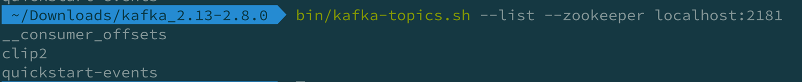

### 카프카 토픽
- 카프카는 메시지를 저장하는 공간인 토픽을 사용한다.
- 토픽은 메시지를 저장하는 물리적인 공간이다.

### 토픽명
- a. Rule 을 정해 패턴화 하여 의미를 부여
    - 예) event.click.practice-lecture.v1, evnet.write.comment.v1
- [x] 토픽명은 한번 정하면 바꾸기가 매우 어려움

### 토픽의 파티션 개수 계산
- 보통은 partition 수 하나에 Consumer Thread 1개 를 매칭한다.
    - 그 이유는 빠른 메세지 처리를 위해서 인데, 그러다 보니 파티션 수가 증가하면 스레트 수가 증가하게 되고 
  서버가 더 많이 필요하게 되고 최종적으로 비용이 많이 올라가게 된다.
- 그래서 기준을 잡아야 하는데 아래와 같다.
  - 1초당 메시지 발행 수 / Consumer Thread 1개가 1초당 처리하는 메시지 수
  - 1000 / 100 = 10 개의 파티션 필요

- [x] 파티션 수를 늘릴 수 있지만, 줄일 수는 없음

### Retention 시간
- 이 시간은 카프카 브로커가 메세지를 어느정도 보관활지 시간이나 바이트 사이즈 따라서 초과할시 자동으로 지우는 설정이다.
- 메세지가 많이 쌓여 디스크가 가득차게 되면 대형 장애가 발생하게 된다.
- 메세지를 받을수도 없고, 메세지를 보낼수도 없게 된다.
- 디스크 크기와 데이터의 중요성에 따라 판단.

### 토픽 생성 실습

```java
import org.apache.kafka.clients.admin.NewTopic;
import org.springframework.context.annotation.Bean;
import org.springframework.context.annotation.Configuration;
import org.springframework.kafka.config.TopicBuilder;

@Configuration
public class KafkaTopicConfiguration {

    @Bean
    public NewTopic clip2() {
        return TopicBuilder.name("clip2").build();
    }
}

```

springboot 실행을 해준뒤 아래 명령어로 토픽을 확인해보면 

bin/kafka-topics.sh --list --zookeeper localhost:2181



clip2 파일이 생성된 것을 확인 할 수 있다.