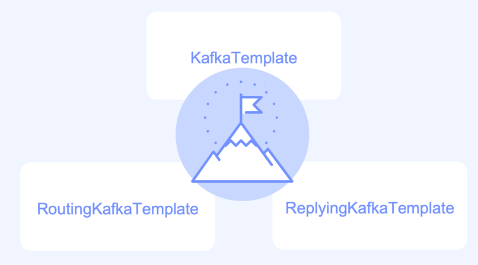

### 카프카 템플릿 설정

1. KafkaTemplate 설정

ProducerFactory 클래스를 이용해 생성
- 트랜잭션을 사용하지 않는 경우, Singleton 으로 생성
- flush() 를 사용할 경우 같은 Producer 를 사용하는 다른 쓰레드에서 지연현상이 발생할 수 있음
    - 2.3 이후부터 producerPerThread 속성 추가
    - true 로 설정하게 되면, 각 쓰레드에서 별도의 생성자를 만들고 캐시처리
    - 생성자가 더이상 필요하지 않을 경우 closeThreadBoundProducer() 를 호출
- 2.5.10 부터는 설정을 업데이트 하거나 제거할 수 있는 method 를 제공
  - SSL 키 변경등에 유용하게 사용
  - reset() 을 사용할 경우, 기존 Producer 는 닫고 새로운 설정으로 Producer 를 생성
  - Transactional, Non-Transactional Producer 로의 변경은 불가능

2. KafkaTemplate 메시지 발송
- 기본적으로 비동기 처리
  - 동기로 처리할 수 있으나, 카프카의 목적이 빠른 스트림 처리이므로 사용하지 않는게 좋음
- 발송방법
  - Message<?> 객체를 이용
    - 메세지에 헤더로 정보를 제공 가능 (TOPIC, PARTITION, KEY, TIMESTAMP)
  - ProducerRecord<K,V> 를 이용
  - 토픽, 파티션, 오프셋 설정 후 전송
- KafkaTemplate Listener
  - 2.5 이전 ListenableFutureCallback 
  - 2.5 이후 KafkaSendCallback 
    - 좀더 쉽게 실패한 메세지를 확인할 수 있음 
    
### RoutingKafkaTemplate 
   - 2.5 부터 지원
   - 전송하는 토픽별로 옵션을 다르게 설정할 수 있음
     - 토픽명은 Regular Expression (정규식) 으로 표현 가능
   - transactions, execute, flush, metric 커맨드를 지원하지 않음.

### ReplyingKafkaTemplate
- 2.1.3 부터 지원
- Consumer 가 특정 데이터를 전달 받았는지 여부를 확인 할 수 있음
- 3개의 Header 가 기본으로 정의됨
  - KafkaHeaders.CORRELATION_ID - 요청과 응답을 연결시키는데 사용
  - KafkaHeaders.REPLY_TOPIC - 응답 토픽
  - KafkaHeaders.REPLY_PARTITION - (optional) 응답 토픽의 파티션
- AggregatingReplyingKafkaTemplate
  - 여러 응답을 한번에 처리