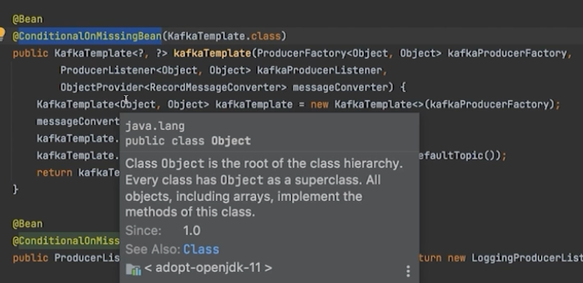

### 카프카 템플릿 설정 (publish message)


1. KafkaTemplate 설정

ProducerFactory 클래스를 이용해 생성
- 트랜잭션을 사용하지 않는 경우, Singleton 으로 생성
- flush() 를 사용할 경우 같은 Producer 를 사용하는 다른 쓰레드에서 지연현상이 발생할 수 있음
    - 2.3 이후부터 producerPerThread 속성 추가
    - 이 속성을 true 로 설정하게 되면, 각 쓰레드에서 별도의 생성자를 만들고 캐시처리
    - 생성자가 더이상 필요하지 않을 경우 closeThreadBoundProducer() 를 호출
- 2.5.10 부터는 설정을 업데이트 하거나 제거할 수 있는 method 를 제공
  - SSL 키 변경등에 유용하게 사용
  - reset() 을 사용할 경우, 기존 Producer 는 닫고 새로운 설정으로 Producer 를 생성
  - Transactional, Non-Transactional Producer 로의 변경은 불가능

2. KafkaTemplate 메시지 발송
- 기본적으로 비동기 처리
  - 동기로 처리할 수 있으나, 카프카의 목적이 빠른 스트림 처리이므로 사용하지 않는게 좋음
- 발송방법
  - Message<?> 객체를 이용
    - 메세지에 헤더로 정보를 제공 가능 (TOPIC, PARTITION, KEY, TIMESTAMP)
  - ProducerRecord<K,V> 를 이용
  - 토픽, 파티션, 오프셋 설정 후 전송
- KafkaTemplate Listener
  - 2.5 이전 ListenableFutureCallback 
  - 2.5 이후 KafkaSendCallback 
    - 좀더 쉽게 실패한 메세지를 확인할 수 있음 
    
### RoutingKafkaTemplate 
   - 2.5 부터 지원
   - 전송하는 토픽별로 옵션을 다르게 설정할 수 있음
     - 토픽명은 Regular Expression (정규식) 으로 표현 가능
   - transactions, execute, flush, metric 커맨드를 지원하지 않음.

### ReplyingKafkaTemplate
- 2.1.3 부터 지원
- Consumer 가 특정 데이터를 전달 받았는지 여부를 확인 할 수 있음
- 3개의 Header 가 기본으로 정의됨
  - KafkaHeaders.CORRELATION_ID - 요청과 응답을 연결시키는데 사용
  - KafkaHeaders.REPLY_TOPIC - 응답 토픽
  - KafkaHeaders.REPLY_PARTITION - (optional) 응답 토픽의 파티션
- AggregatingReplyingKafkaTemplate
  - 여러 응답을 한번에 처리

# 정리

### KafkaTemplate 
- Sync
- Async
- 
### RoutingKafkaTemplate
- 토픽을 구분해서 Deserializer 적용
- 
### ReplyingKafkaTemplate
- Consumer 가 데이터를 처리하고 지정된 토픽으로 재발송

### KafkaTemplate 실습
```java
package practice.chap1clip1.configuration;

import org.apache.kafka.clients.producer.ProducerConfig;
import org.apache.kafka.common.serialization.StringSerializer;
import org.springframework.context.annotation.Bean;
import org.springframework.context.annotation.Configuration;
import org.springframework.kafka.core.DefaultKafkaProducerFactory;
import org.springframework.kafka.core.KafkaTemplate;
import org.springframework.kafka.core.ProducerFactory;

import java.util.HashMap;
import java.util.Map;

@Configuration
public class KafkaTemplateConfiguration {

    @Bean
    public KafkaTemplate<String, String> kafkaTemplate() {
        return new KafkaTemplate<>(producerFactory());
    }

    private ProducerFactory<String, String> producerFactory() {
        return new DefaultKafkaProducerFactory<>(producerProps());
    }

    /**
     * SpringBoot 가 제공하는 KafkaTemplate 디폴트와 유사한 형태로 정의가 된것이다.
     */
    private Map<String, Object> producerProps() {
        Map<String, Object> props = new HashMap<>();
        // Kafka 서버 주소
        props.put(ProducerConfig.BOOTSTRAP_SERVERS_CONFIG, "localhost:9092");
        // 키와 값의 직렬화 방식
        props.put(ProducerConfig.KEY_SERIALIZER_CLASS_CONFIG, StringSerializer.class);
        // 키와 값의 직렬화 방식
        props.put(ProducerConfig.VALUE_SERIALIZER_CLASS_CONFIG, StringSerializer.class);

        return null;
    }
}

```

### KafkaTemplate 실습 main 
```java

package practice.chap1clip1;

import org.springframework.boot.ApplicationRunner;
import org.springframework.boot.SpringApplication;
import org.springframework.boot.autoconfigure.SpringBootApplication;
import org.springframework.context.annotation.Bean;
import org.springframework.kafka.core.KafkaTemplate;


@SpringBootApplication
public class Chap1Clip1Application {

    public static void main(String[] args) {
        SpringApplication.run(Chap1Clip1Application.class, args);
    }


    @Bean
    public ApplicationRunner runner(KafkaTemplate<String, String> kafkaTemplate) {
        return args -> {
            // 기본적으로 async 로 처리가 되는데, 명확하게 보기 위해선 별도의 처리가 필요하다.
            kafkaTemplate.send("clip3", "Hello, clip3");
        };
    }

}

```

### 위와같이 재 정의하면 에러가 안나나?
- 안난다. 그이유는 @ConditionalOnMissingBean 이라는 어노테이션이 붙어있기 때문이다.
- @ConditionalOnMissingBean
  - 해당 빈이 없을때만 해당 빈을 생성한다.
  - 즉, KafkaTemplate 이 없을때만 생성한다.
