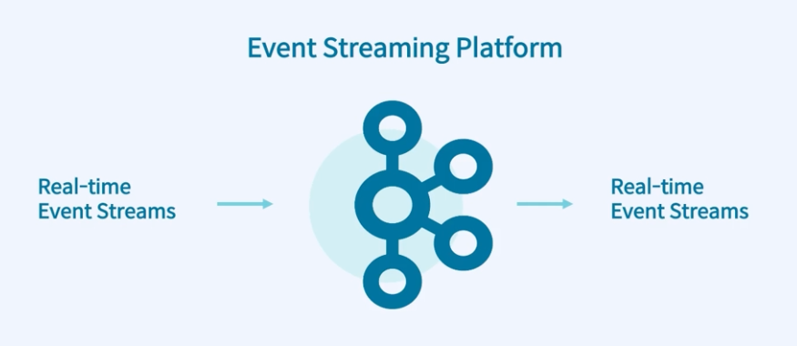
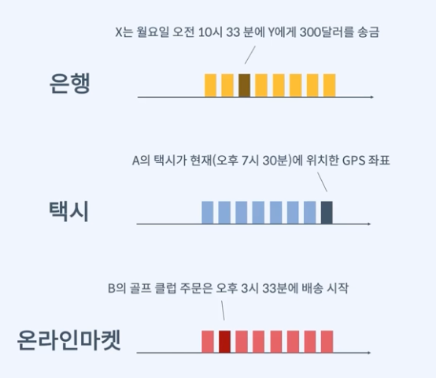
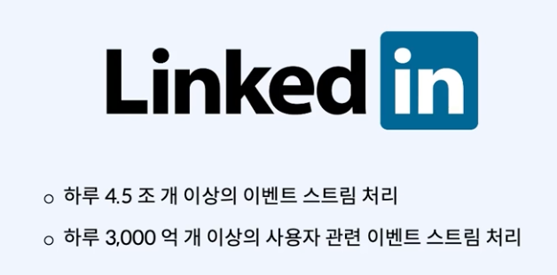
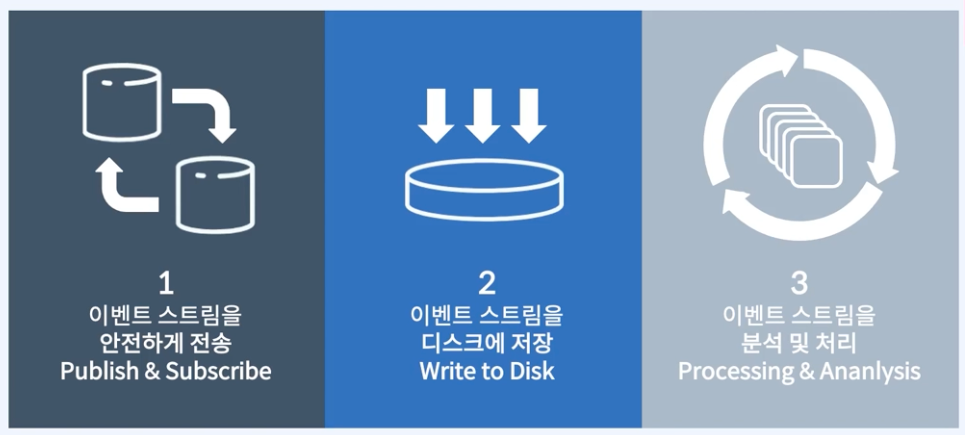
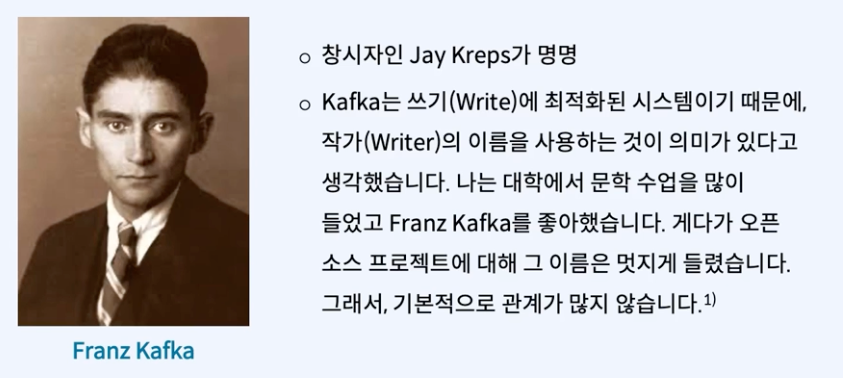
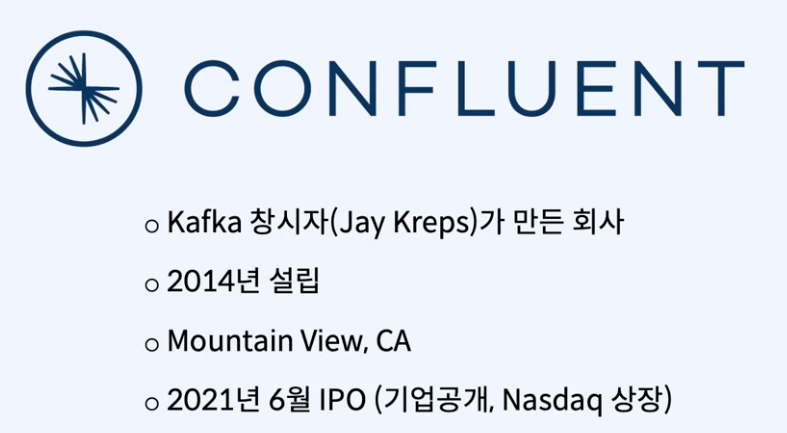
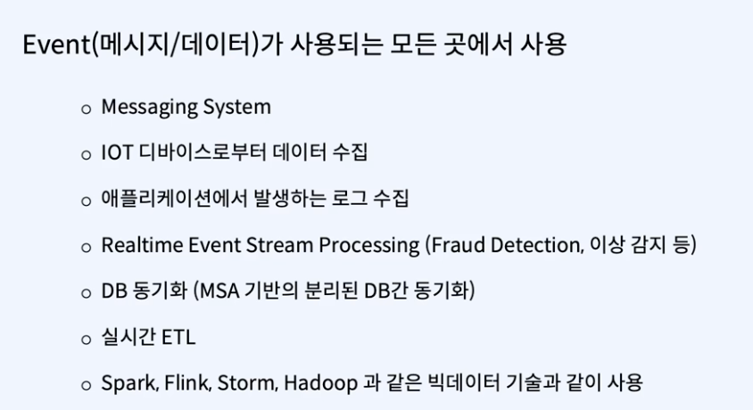
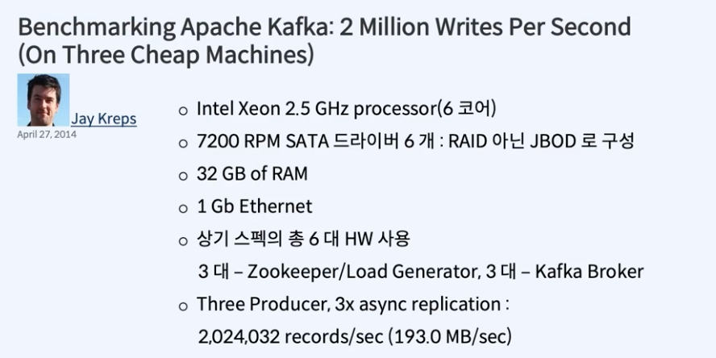
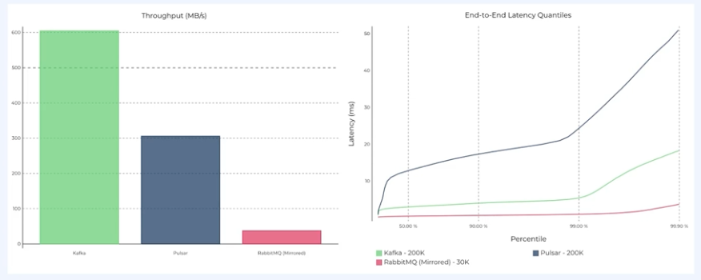
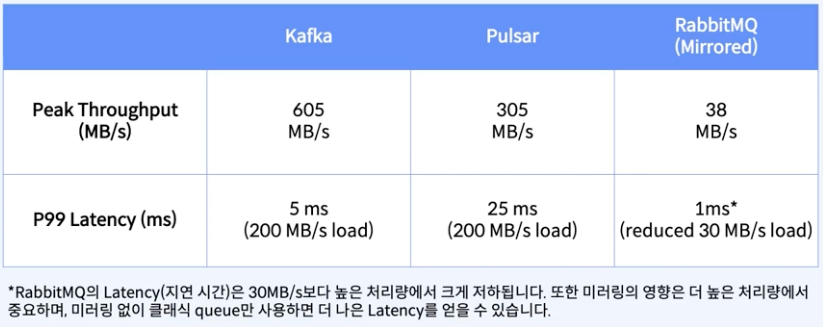

### 아파치 카프카가 뭘까 ?

- 데이터 이모션 플랫폼
- 움직이는 데이터를 처리하는 플랫폼이다. ( 이벤트 스트림 플랫폼 )
- 데이터를 수집하고, 처리하고, 저장하고, 분석하는 플랫폼이다.

### Event 는 비즈니스에서 일어나는 모든 일 (데이터) 을 의미
- 웹사이트 에서 무언가를 클릭하는 것
- 청구서 발행
- 송금
- 배송 물건의 위치 정보
- 택시의 GPS 좌표
- 셋서의 온도/압력 데이터

### 이러한 이벤트는 BigData 의 특징을 가진다.
- 비즈니스 모든 영역에서 광범위 하게 발생
- 대용량의 데이터(Big Data) 발생

### Event Stream 은 연속적인 많은 이벤트 들의 흐름을 의미한다.

이런 이벤트 스트림을 처리하기 위해 개발된 아파치 카프카는 Linked in 에서 개발되었다.

*linked in 은 구인구직 사이트이다.*

### history 
- linked in 에서 구직활동을 하는 사람, 구인활동을 하는 기업 들의 의해 다양한 이벤트 들이 발생하게 되는데.
- 이때 linked in 에서 요구 사항이 있었다.
- 데이터는 많이 생기는데 사람들이 실시간으로 무엇을 하는지 ? 가 궁금했다.
- 기존의 Messaging Platform (예, MQ) 로 처리 불가능했다. (도저히 처리가 감당이 안된거야)
- 그러다 보니까 이벤트 스트림 처리를 위해 개발한것이 Kafka 다.

### 주로 3가지 특징

### 어디서 이름 을 따 왔을까 ?

- 문학소설을 좋아했는데 write 의 성격이 강하니까 좋아하는 소설작가의 이름을 따서 만든것이다.

### 2011년 4월 첫번째 릴리즈
- 2012 년 최상위 오픈소스로 정식 출시 될정도로 성공적이였다.
- 포춘 100 대 기업중 80% 이상이 사용중이다.

### Confluent 라는 회사를 빠뜨릴수 없는데

### 사용사례는 ?

*Extract Transfer Load (ETL) 은 데이터를 추출하고, 변환하고, 저장하는 과정을 의미한다.*

### 산업 분야
- 교통 분야
  - 운전자 - 탑승자 매치
  - 도착 예상시간 (ETA)
  - 실시간 차량 진단
- 금융
  - 사기 감지, 중복 거래 감지
  - 거래, 위험 시스템
  - 모바일 애플리케이션 / 고객 경험
- 오락
  - 실시간 추천
  - 사기 감지
  - In-App 구매
- 온라인 마켓
  - 실시간 재고 정보
  - 대용량 주문의 안전한 처리

### Kafka 의 성능 (spec)

### 기존의 MQ 와의 차이는 어떨까 ?
- 왼쪽 그림은 높으면 높을수록 좋은것 오른쪽은 낮으면 낮을수록 좋은것을 나타내는 지표이다. (벤치마킹 그래프) 

- 처리량

### 요약 
- 흐르는 데이터를 처리하는 플랫폼
- pub-sub 기능을 제공하고
- 데이터를 안전하게 디스크에 저장하고
- 실시간으로 들어오는 이벤트 스트림을 분석 및 처리