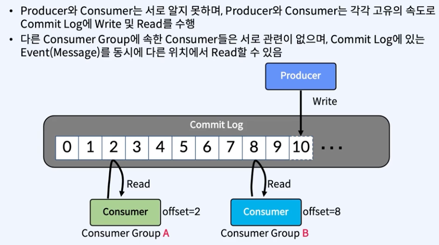

### 기본 개념 및 이해
- Topic, Partition, Segment

### Topic
- kafka 안에서 메세지가 저장되는 장소, 논리적인 표현

### Producer
- 메세지를 만들어서 kafka 의 토픽으로 보내주는 애플리케이션

### Consumer
- kafka Topic 내의 메세지를 가져와서 소비 (Consume) 하는 애플리케이

### Consumer Group
- Topic 의 메세지를 사요ㅕㅇ하기 위해 협력하는 Consumer 들의 집합
- 하나의 Consumer 는 하나의 Consumer Group 에 포함되며, Consumer Group 내의 Consumer 들은 협력하여 Topic 의 메세지를 분산 병렬 처리함.

### Producer 과 Consumer 의 기본 동작 방식

- 여기서 중요한것은 둘이 서로 알지 못하는것이다. 아래 그림과 같다

### Commit Log 는 뭘까 ?
- 0 ~ 10 번까지 쌓이기만 한다.

### Event 의 위치
- kafka 도 commit log 라고 하는 개념의 기반하에 만들어졌다
- 때문에 이벤트의 이취 OFFSET 이라는 용어를 사용하고 있다. 
- commit log 의 맨 끝을 LOG-END-OFFSET 이라고 한다.
- 그리고 Consumer 가 가져간 (읽어간) 위치를 마크하는데 이런 위치를 current-offset 이라고 한다.
- 그리고 이 current-offset 과 log-end-offset 의 차이를 consumer-lag 이라고 한다.

### Logical View

- Topic : Kafka 안에서 메시지가 저장되는 장소, 논리적인 표현
- Partition : Commit Log, 하나의 Topic 은 하나 이상의 Partition 으로 구성한다. 병렬처리(Throughput 향상)를 위해서 다수의 Partition 사용
- Segment : 메시지(데이터)가 저장되는 실제 물리 File Segment File 이 지정된 크기보다 크거나 지정된 기간보다 오래되면 새 파일이 열리고 메시지는 새 파일에 추가됨

### 피지컬 View

- Topic 생성시 Partition 개수를 지정하고, 각 Partition은 Broker들에 분산되며 Segment File들로 구성됨
- Rolling Strategy : log.segment.bytes(default 1 GB), log.roll.hours(default 168 hours)

### Segment File : 메시지(데이터)가 저장되는 실제 물리 File
  - 분리해서 만들어 진다.
  - 하나의 시스템 내에 10 기가 100기가 이렇게 만들수 없기때문에 용량을 정하거나, 시간에 따라서 롤링해서 파일을 만든다.
  - 아래가 그 그림이다

### Partition당 하나의 Active Segment
- Partition 당 오직 하나의 Segment 가 활성화(Active) 되어 있음 -> 데이터가 계속 쓰여지고 있는 중

### Topic, Partition, Segment 의 특징
